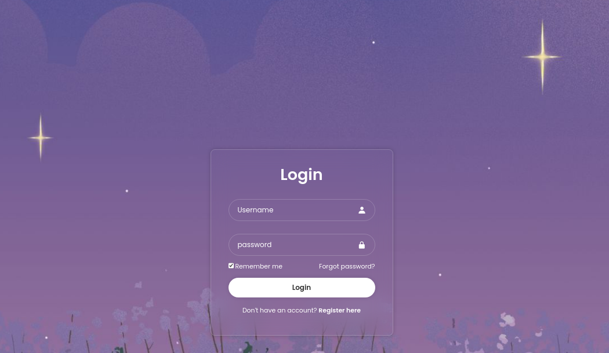

# Login Form (HTML & CSS)

## Description 💬

This project provides a simple, responsive login form built using HTML and CSS. It is designed to be lightweight and easily customizable for integration into any web application.

## Features 🌟

- Basic user authentication form with **username** and **password** fields.
- Clean, minimalist design with modern CSS.
- Fully responsive layout that adapts to mobile and desktop screens.
- Focus states for accessibility and ease of use.

## Preview



## Installation ⚙️

To use this login form:

1. **Clone the repository:**
   ```bash
   git clone https://github.com/Heshbon/login-form.git

2. Navigate to the project folder:
    ```bash
    cd login-form

3. Open index.html in your browser to see the form in action.

## How to Customize

- Modify the form fields: Update the HTML code in index.html to include additional fields like "Remember Me" or "Forgot Password".
- Change the styling: Customize the colors, fonts, and layout by editing the styles.css file.
- Add Backend: Connect the form to your backend authentication system by adding the action attribute to the <form> tag in index.html.

## Usage 🚀

1. Username & Password fields: User enters their credentials (these are not validated in this static version, but you can link to a backend for validation).

2. Submit button: Triggers the form submission. Customize it to link to your authentication logic.

## Contributing 🤝

If you'd like to contribute to this project:

1. Fork the repository.

2. Create a new branch for your feature or fix.

3. Submit a pull request for review.

## Author ✒️

+ Hesbon Kipchirchir [Heshbon](https://github.com/Heshbon)

## License 🔒

+  This project is licensed under the [MIT License](https://opensource.org/licenses/MIT) - see the [LICENSE](https://github.com/Heshbon/login-form/blob/main/LICENSE) file for details.

## Acknowledgments

- HTML5 & CSS3 for building the structure and style.
- Inspirations from modern web UI patterns.

## External Resources 📚

For more inspiration on writing a good README, check out these resources:

- [Awesome README](https://github.com/matiassingers/awesome-readme)

- [How to Write a Good README?](https://www.makeareadme.com/)